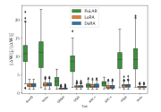
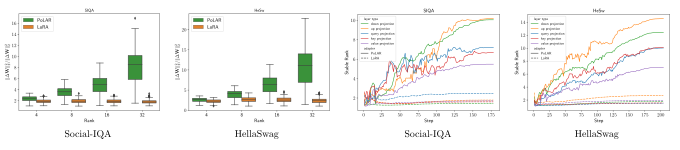

# PoLAR: Polar-Decomposed Low-Rank Adapter Representation


This repo hosts PoLAR, a polar-decomposition-inspired reparameterization for fine-tuning LLMs in a parameter-efficient fashion. PoLAR (i) **resolves the rank inefficiency encountered in LoRA**, (ii) provably accelerates convergence on a canonical LoRA problem, and (iii) **boosts performance on downstream tasks for model sizes up to and including 30B.**

### LoRA Suffers from Rank Inefficiency

LoRA often does not fully exploit the low-rank subspace, leading to a low effective (stable) rank. In particular, even if the rank of LoRA is chosen as `r=32` or `r=16`, the stable rank of $\Delta W = BA$ is often close to 1; see an example of applying LoRA on LLaMA2-7B in the figure below. In informal terms, **LoRA only leverages a rank 1 subspace**. 

This motivating finding occurs across several datasets and a minimal reproducible example of it is given in the `notebooks/lora_low_effective_rank.ipynb` notebook which evaluates the stable rank of the official LoRA DeBERTa XXL checkpoints.



### How Does PoLAR Address the Rank Inefficiency?

PoLAR is a polar-decomposition-inspired reparameterization of LoRA. In particular, we introduce direction matrices $X$ and $Y$ with orthonormal columns (i.e., $X$ and $Y$ live in Stiefel manifolds), and an unconstrained scale matrix $\Theta$. The low-rank
update is then formulated as $\Delta W = X \Theta Y^\top$. Matrices $X$ and $Y$ are optimized 
using tools from Riemannian optimization. 

Such a co-design of architecture and optimizer significantly improves the stable rank in low-rank adaptation. This is illustrated in the figure below: PoLAR's stable rank varies with `r` and increases throughout training.



## Setup and Dependencies

Dependencies are given in `requirements.txt`. To recreate the environment, please run
```sh
cd path/to/polar/repo
conda create --name polar python=3.10
conda activate polar
pip install -r requirements.txt
```
Note that the Gemma-3 experiments require newer versions. For the setup, see the section on Gemma-3.

## Results


### Commonsense Reasoning with Llama-2-7B


| Rank | Adapter | BoolQ | PIQA | SIQA | HeSw | WiGr | ARC‑e | ARC‑c | OBQA | Avg. |
|------|---------|------:|-----:|-----:|-----:|-----:|------:|------:|-----:|---------:|
| 4  | LoRA          | 87.16 | 81.01 | 58.85 | 82.36 | 74.35 | 81.90 | 57.68 | 56.80 | 72.51 |
| 4  | DoRA          | 87.22 | 80.30 | 58.96 | 82.39 | 75.22 | 81.69 | 57.85 | 56.80 | 72.55 |
| 4  | [PoLAR](https://github.com/kcc-lion/polar/releases/download/llama-2-7b/polar_rank4.zip)         | 87.49 | 82.59 | 59.31 | 81.23 | 81.77 | 81.61 | 56.31 | 55.80 | **73.26** |
| 8  | LoRA          | 87.34 | 81.07 | 58.80 | 82.68 | 74.66 | 82.24 | 58.11 | 55.80 | 72.59 |
| 8  | DoRA          | 87.49 | 80.58 | 58.39 | 82.32 | 75.22 | 82.24 | 58.19 | 55.60 | 72.50 |
| 8  | [PoLAR](https://github.com/kcc-lion/polar/releases/download/llama-2-7b/polar_rank8.zip)         | 87.74 | 82.70 | 59.62 | 82.14 | 82.40 | 81.36 | 56.91 | 55.20 | **73.51** |
| 16 | LoRA          | 86.94 | 81.18 | 58.96 | 82.57 | 76.01 | 82.58 | 57.85 | 56.00 | 72.76 |
| 16 | DoRA          | 86.85 | 81.34 | 58.29 | 82.39 | 74.59 | 82.62 | 57.68 | 55.40 | 72.39 |
| 16 | [PoLAR](https://github.com/kcc-lion/polar/releases/download/llama-2-7b/polar_rank16.zip)         | 88.01 | 82.92 | 59.93 | 82.68 | 81.77 | 81.82 | 57.51 | 57.40 | **74.00** |
| 32 | LoRA          | 87.89 | 81.56 | 59.06 | 82.51 | 72.61 | 82.37 | 56.83 | 54.60 | 72.18 |
| 32 | DoRA          | 87.61 | 81.45 | 58.70 | 82.50 | 74.43 | 82.28 | 57.17 | 55.60 | 72.47 |
| 32 | [PoLAR](https://github.com/kcc-lion/polar/releases/download/llama-2-7b/polar_rank32.zip)         | 88.13 | 82.64 | 60.03 | 83.12 | 82.00 | 81.99 | 56.14 | 55.60 | **73.71** |

To reproduce, please run
```sh
bash scripts/train_and_eval.sh <adapter_name> <lr> <reg_lambda> <num_epochs> <rank> <dataset>
```
To run the evaluation of checkpoints, please run
```sh
bash scripts/eval.sh /path/to/adapter/dir <task> meta-llama/Llama-2-7b-hf
```

For instance, to run PoLAR, LoRA, and DoRA on PIQA with rank 32

```sh
bash scripts/train_and_eval.sh polar 4e-3 5e-3 5 32 piqa 
bash scripts/train_and_eval.sh lora 4e-4 5e-3 5 32 piqa 
bash scripts/train_and_eval.sh dora 4e-4 5e-3 5 32 piqa 
```

### Gemma-3 MetaMathQA

The experiments with Gemma-3 require newer versions and the environment builds on top of `nvcr.io/nvidia/pytorch:25.03-py3`. To set up the container and run the evaluation of Gemma-3 checkpoints, please run:

```sh
# set up
export HF_TOKEN=your_hf_token
cd /path/to/polar/repo
docker build --file gemma3.Dockerfile -t polar:dev .
docker run --rm -it --gpus '"device=1,2,3,4"' -e HF_TOKEN=$HF_TOKEN polar:dev

# in container
bash scripts/eval_docker.sh /path/to/adapter/dir gsm8k google/gemma-3-27b-pt

# remove container
docker rmi polar:dev
docker system prune -a
```

### Stable Rank

For computation of the stable rank of the official LoRA checkpoints available at https://github.com/microsoft/LoRA, please see `lora_low_effective_rank.ipynb`. The notebook runs easily on google colab.

To reproduce the stable rank and pairwise distance plot of our trained adapters, please run the following after having trained any of the adapters above. 

```sh
python stable_rank/analyze_sr.py --peft_model_id=/path/to/ckpt_dir --save_path=/path/to/ckpt_dir
```

### Retraction/Landing Benchmarking

Please run `runtime_comparison.ipynb`.


## Comments


### Registration of Custom Module Mapping
Note that the information about the custom module mapping does not persist when you save the PEFT model. When loading the model, you have to register the custom modules again:

```python
from peft import PeftModel, PeftConfig
from peft.tuners.polar.layer import PoLARLinear

peft_config = PeftConfig.from_pretrained(peft)
custom_module_mapping = {torch.nn.Linear: PoLARLinear}
# register the new mapping
peft_config._register_custom_module(custom_module_mapping)
model = PeftModel.from_pretrained(self._model, peft, revision=revision, config=peft_config)
```

### Changes to lm-evaluation-harness

We require an editable install of lm-evaluation-harness due to the following:

* Registration of custom module mapping in `lm_eval/models/huggingface.py`. See discussion above.
* Avoidance of `vocab_size` check for Gemma 3 which raises `AttributeError`. See issue https://github.com/huggingface/transformers/issues/36683.
* Adapting `doc_to_text` in `tasks/gsm8k/gsm8k.yaml` and `tasks/hendrycks_math/hendrycks_math.yaml`.


### Other
* The registration of the parameterization was used for research purposes only and can be disabled in practical scenarios to increase runtime efficiency. The appropriate line to comment out is line 119 in `peft/src/peft/tuners/polar/layer.py`.

## Credits

* The `finetune_commonsense.py` script is originally adapted from https://github.com/tloen/alpaca-lora/blob/main/finetune.py.
* The lm-evaluation-harness is taken from https://github.com/EleutherAI/lm-evaluation-harness.
* The editable PEFT version is based on v0.14.1.dev0 of https://github.com/huggingface/peft.
* The `run_glue.py` script is adapted from https://github.com/huggingface/transformers/blob/main/examples/pytorch/text-classification/run_glue.py.
